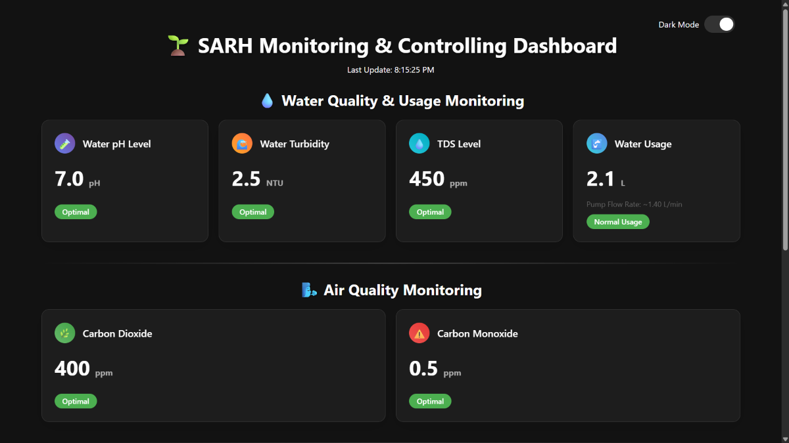
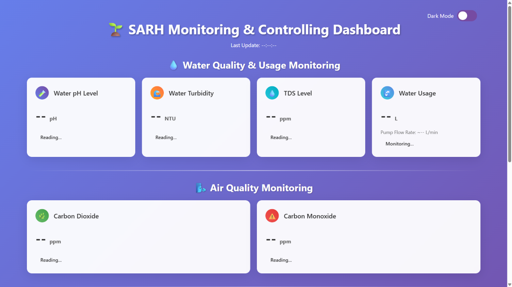
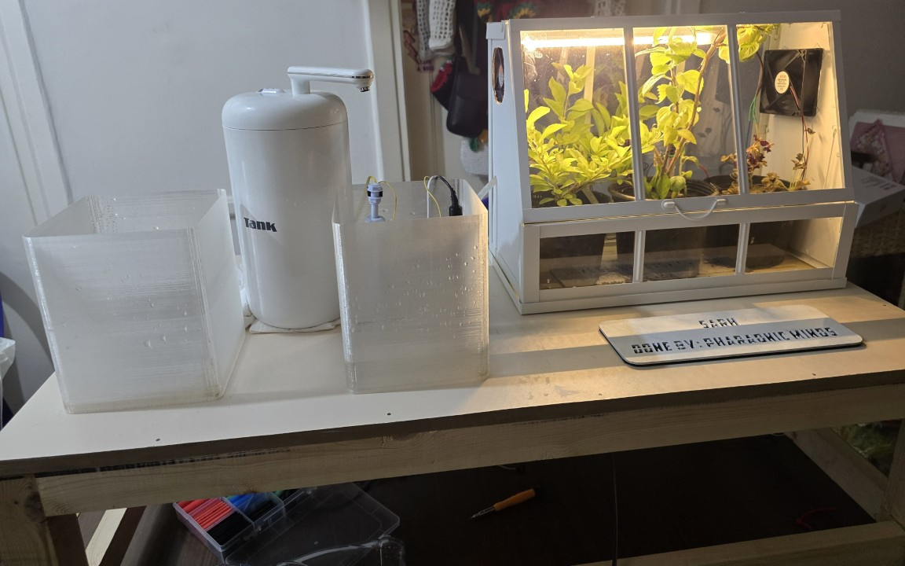

# SARH - Sustainable Agriculture from Recovered Harm

[](#)
[](#)
[](#)

**Repository for SARH – a GAIAthon 2025 project by Team Pharaonic Minds.**

## Overview

**SARH (Sustainable Agriculture from Recovered Harm)** is a smart IoT-powered solution that tackles industrial air and water pollution in Egypt by transforming environmental waste into agricultural resources.

Through a dual-system approach—**air purification** and **water filtration**—SARH reclaims toxic outputs from factories and redirects them to power smart greenhouses. These closed-loop systems are monitored and controlled using affordable IoT sensors and actuators, improving agriculture in polluted zones.

---

## Team Pharaonic Minds

- **Mohammed Ihab** – Team Leader  
- **Bassam Sayed** – Member  
- **Abdallah Samy** – Member  
- **University:** The British University in Egypt  
- **Country:** Egypt  

---

## Problem Statement

Egypt and many african countries faces critical environmental degradation due to factory emissions and polluted wastewater, resulting in:

- Toxic air unsuitable for humans or agriculture.
- Contaminated Nile water going to waste.
- Reduced agricultural yield due to polluted soil and lack of clean water.

---

## Our Solution: SARH

A **Smart IoT-Driven Environmental Recovery Unit** that:

### Air Pollution Recovery System
- Filters exhaust air from factories.
- Monitors air quality using sensors inside greenhouses after filtering.

### Water Pollution Recovery System
- Filters wastewater through a multi-stage system.
- Monitors water quality, turbidity, pH, and TDS.
- Uses soil moisture feedback to control irrigation automatically.

---

## Technologies & Components Used

| Category | Component | Description |
|---------|-----------|-------------|
| Microcontroller | ESP32 | Wi-Fi-enabled controller for cloud-based monitoring |
| Air Monitoring | MQ-135, MQ-7 | Measures carbon dioxide and carbon monoxide |
| Water Monitoring | TDS, pH, Turbidity sensors | Ensures water quality before irrigation |
| Soil Monitoring | Soil Moisture Sensor, DHT11, LDR | Measures soil conditionsm, greenhouse air humidity, and light intensity |
| Actuators | Water Pump and Air Fan | Control fluid and air movement |
| Filtration | Water and Air Filters | Physically remove harmful particles |

---

## Architecture Overview

The system is modular, consisting of:
- Factory exhaust interception and filtration unit
- Wastewater diversion, filtration, and reuse module
- A smart greenhouse with IoT feedback systems

> Detailed hardware schematics are available in the [`/hardware`](/hardware) directory.

---

## Development Stages

1. **Research & Material Selection**
2. **System Simulation & Design**
3. **Prototype Development**
4. **Cloud Integration & Monitoring**
5. **Field Testing & Optimization**

---

## Impact

- Transforms industrial waste into agricultural input
- Reduces health risks near factories
- Promotes sustainable agriculture in polluted regions
- Scalable to other regions across Africa and beyond

---

## Challenges & Mitigation

| Challenge | Solution |
|----------|----------|
| High installation cost | Start with pilot programs, seek government/NGO funding |
| Factory resistance | Demonstrate ROI through reclaimed water & CSR benefits |

---

## Images

- **Dashboard in Dark Mode**



- **Dashboard in Light Mode**



- **Prototype**



Find all dashboard and prototype images in the [`/img`](/img) folder.

---

## Repository Structure

```bash
SARH-2025-GAIAthon/
├── code/               # Source code for ESP32 and cloud integration
├── hardware/           # Circuit diagrams, schematics
├── img/                # Images and visuals of the project
└── README.md
